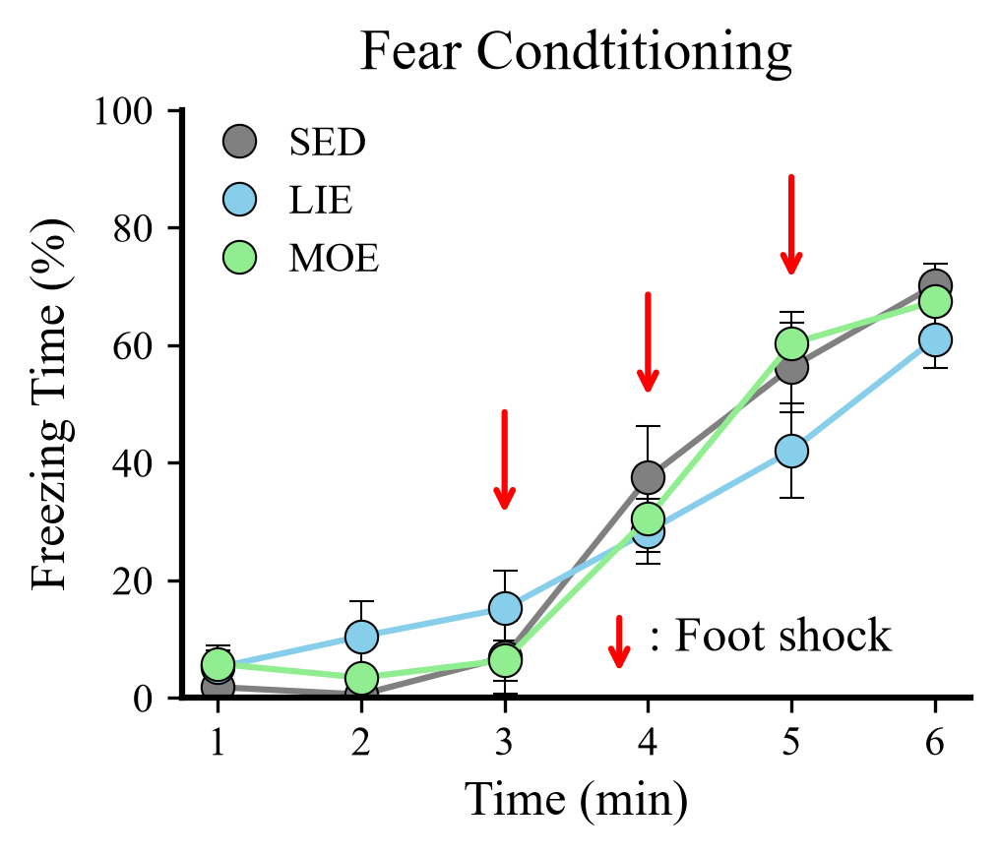
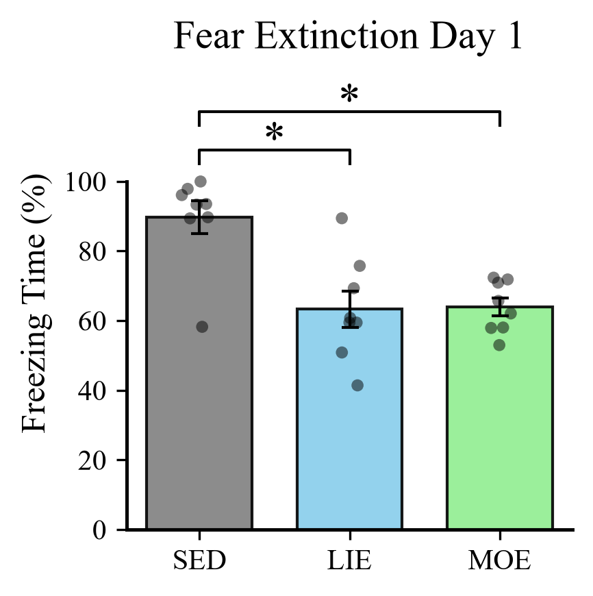
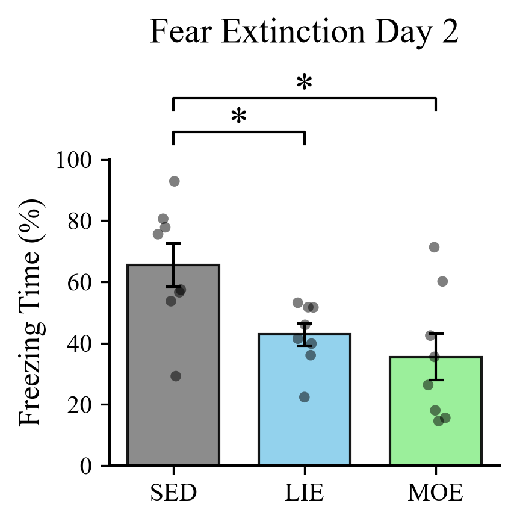
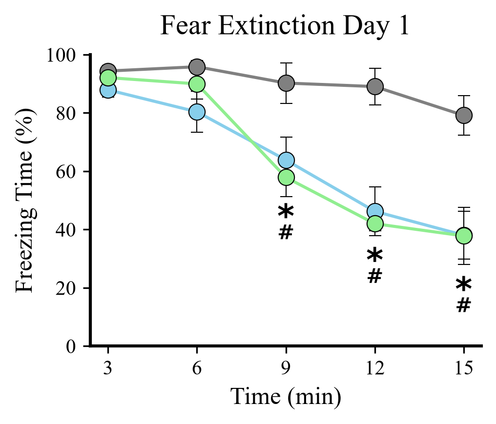
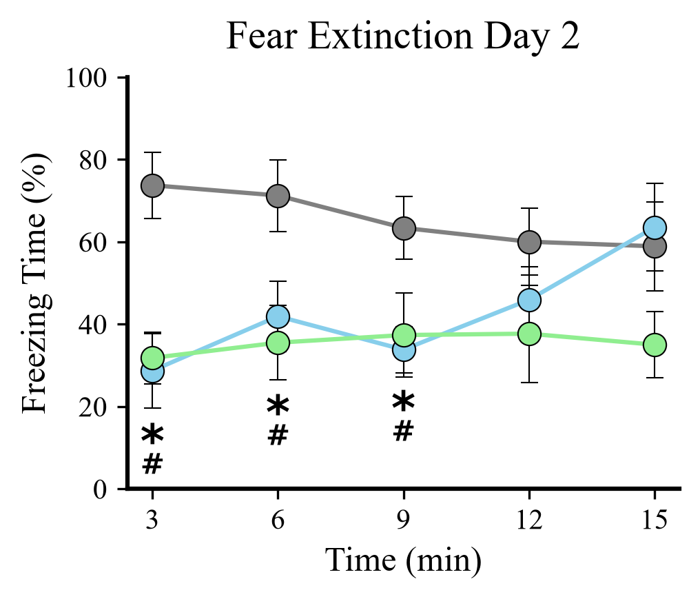

# Python_MSSE_analysis
## はじめに

このリポジトリには、MSSE（Medicine & Science in Sports & Exercise) に掲載された以下の論文の実験の一部の内容を、Pythonを用いて解析したコードや出力したグラフ、統計解析結果のテキストファイルが保存されています。もともとのRでの解析はAnalyse_MSSEというリポジトリに格納しています。なお、実験のRawデータに関しては公開していません。<br>

 **掲載論文 (DOI):** [Accelerated Fear Extinction by Regular Light-Intensity Exercise: A Possible Role of Hippocampal BDNF-TrkB Signaling.](https://doi.org/10.1249/mss.0000000000003312)<br>
 **GitHubリポジトリ:** [Analyse_MSSE](https://github.com/RyoShimoda/Analyse_MSSE)<br>

## 結果の概要

**４週間の運動を行うことで、恐怖記憶の消去学習が促進される。**<br>
MSSE論文の実験の内容の一部になりますが、ラットに恐怖条件付け試験を行い、場所の恐怖（Contextual fear memory) を記憶させた後、安静群 (Sedentary: SED)、低強度運動群 (Light-intensity exercise: LIE)、中強度運動群 (Moderate-intensity exersice: MOE) に分けて４週間の運動介入を行いました。最後の運動の翌日から、消去学習を24時間おきに二日間実施しました。その結果、安静群に対し、両運動群で、消去学習一日目、二日目における立ちすくみ時間（恐怖記憶の指標: Freezing Time (%)）の総量が減少しました。15分間の消去学習を3分おきに分析してみると、消去学習一日目では、両運動群は最初の６分間は安静群と同様に恐怖状態を示していますが、９分から立ちすくみ時間が有意な低値を示し始めました。これは、運動することによって、恐怖記憶の消去学習が促進され、「この場所が安全であること」をより早く学習したことを意味していると考えられます。また、消去学習二日目では、最初の９分間、安静群に対し両運動群で立ちすくみ時間が有意に低値であることが分かりました。このことは、両運動群は一日目で記憶した「この場所は安全である」という記憶を、二日目まで保持していたことを示していると考えられます。(* < 0.05, # < 0.05, 各群 n = 8)

<table>
  <tr>
    <td></td>
    <td></td>
    <td></td>
  </tr>
  <tr>
    <td align="center">恐怖条件付け</td>
    <td align="center">消去学習一日目</td>
    <td align="center">消去学習二日目 </td>
  </tr>
</table>

<table>
  <tr>
    <td></td>
    <td></td>
  </tr>
  <tr>
    <td align="center">消去学習一日目 三分ごと</td>
    <td align="center">消去学習二日目 三分ごと</td>
  </tr>
</table>


## リポジトリの構成

```
├── Results/        # 解析結果が格納されているフォルダ
│   ├── Plots/      # 描画されたグラフが格納されているフォルダ
│   │   ├── ○○.png
│   │   └── ⋮
│   ├── Anovakun_Like_Analysis_Ex1.txt # Rのanovakun関数 (井関ら) に類似した出力結果が出力されているファイル (消去学習一日目)
│   ├── Anovakun_Like_Analysis_Ex2.txt 
│   └── Anovakun_Like_Analysis_FC.txt  
├── Scripts/        # 実行用のJupyterファイルと関数用のpyファイルが格納されているフォルダ
│   ├── Create_Dataset.py                 # データ読み込みと整形を行う関数が格納されたファイル
│   ├── Create_Plots.py                   # グラフの描画関数が格納されたファイル
│   ├── Fear_Conditioning_Analysis.ipynb  # 恐怖条件付けのデータ読み込み、グラフの整形、統計解析を行うファイル
│   ├── Fear_Extinction_Day_1.ipynb       
│   ├── Fear_Extinction_Day_2.ipynb       
│   └── Statistical_Analysis.py           # Rのanovakunに類似した出力を出す関数が格納されたファイル
├── practice/       # 練習で用いたJupyterファイルやグラフが格納されているフォルダ
│   ├── Results/    
│   └── scripts/
├── requirements.txt # 必要なパッケージ一覧
└── README.md
```

## 実行環境

- **OS:** Windows 11
- **Python version:** 3.14.7

### 使用パッケージ
- numpy>=1.26
- pandas>=2.1
- matplotlib>=3.8
- seaborn>=0.13
- scipy>=1.11
- pingouin>=0.5
- openpyxl>=3.1

